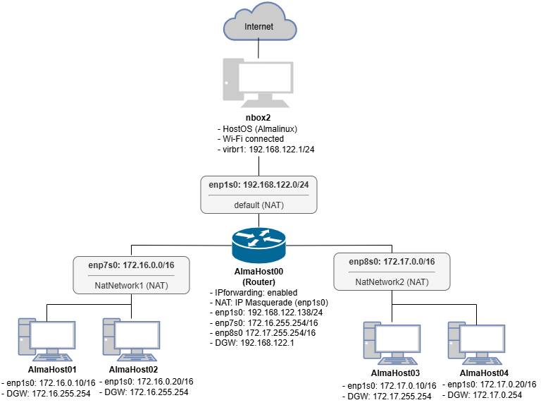

# KVM Network Lab

## 概要
自宅ミニPC上に、KVM/QEMUを用いた仮想ネットワーク環境を構築しました。

## 目的
- **ネットワーク技術の習得**: `nmcli` や `ip` コマンド等の操作を通じて、OSレベルでのネットワーク制御、ルーティング、およびブリッジ構成への理解を深める。
- **実践的なサーバ構築の検証基盤**: 各種ミドルウェアの導入やOS設定を自由に行える環境を確立し、実務を想定したサーバ構築の学習を行う。

## 構成
- Host OS: AlmaLinux
- Hypervisor: KVM/QEMU + libvirt
- Guest OS: Almalinux (cloud-init)
- VM:
  - AlmaHost00: Router
  - AlmaHost01-04: Host
- Network:
  - default: 192.168.122.0/24
  - NatNetwork1: 172.16.0.0/16
  - NatNetwork2: 172.17.0.0/16
- User: haru

## ネットワーク構成図


## 実施手順

### 1. ホストOSの準備

**① 仮想化支援機能の確認**
CPU が仮想化支援機能（Intel VT-x）に対応していることを確認する。
```bash
lscpu | grep Virtualization
```
以下のように表示されれば問題ない。
```bash
Virtualization: VT-x
```

**② パッケージのインストール**
```bash
dnf update -y

dnf install -y \
  qemu-kvm \
  libvirt \
  libvirt-daemon \
  libvirt-daemon-config-network \
  libvirt-daemon-driver-qemu \
  virt-install \
  genisoimage
```

**③ libvirtdの起動と自動起動設定**
```bash
systemctl enable --now libvirtd
```


**④ 一般ユーザーにlibvirtグループへ追加**
一般ユーザでも VM の操作（起動・停止・一覧表示）を行えるようになる。
```bash
usermod -aG libvirt haru
```

### 2. ネットワークの作成

### 3. 仮想マシンの作成

### 4. 仮想マシンの設定

### 5. 疎通確認


## 学んだこと
- KVM, QEMU, libvirtについて
  - KVM: Linuxをハイパバイザーとして動作させる
  - QEMU: マシンエミュレーター
  - libvirt: 仮想化基盤を管理・操作するためのインターフェース
- NAT, bridge, isolated ネットワークの違い
  - NAT: 内部ネットワークと外部ネットワークを区別し、アドレス変換を行う
  - bridge: 同一セグメントに接続される
  - isolated: 外部ネットワークから完全に分離される
- nmcli によるネットワーク設定は永続的だが、ip は一時的で再起動で消えてしまう
  - そのため、nmcli は設定変更に、ip は状態確認に利用する
- インターフェースの設定適用に `nmcli con up` を使用するとSSH接続が切れるので、`nmcli dev reapply` を使用する
- Linuxは`net.ipv4.ip_forward`パラメータを有効にすることで、フォワーディング（パケット転送）させることができる
  - `echo 'net.ipv4.ip_forward = 1' >> /etc/sysctl.conf` を実行後、再起動を行うことで有効になる
- フォワーディングの設定だけだと、ホストOSに直接接続されていない仮想マシンはインターネットに接続することができないため、ルーターにNATの設定を行う必要がある
- draw.ioによるネットワーク構成図の作成や、Markdownによる手順書の作成について学ぶことができた


## 今後の学習
- cloud-initやlibvirt Network XML formatなどの公式ドキュメントは基本的に英語で書かれていることが多いため、英語を学ぶ必要があると感じた
- Dockerなどのコンテナ技術についても学習し、仮想マシンとの違いや用途に応じた使い分けを理解していきたい
- AnsibleなどのIaCツールを使って、今回の構成を自動化することにも挑戦してみたい
